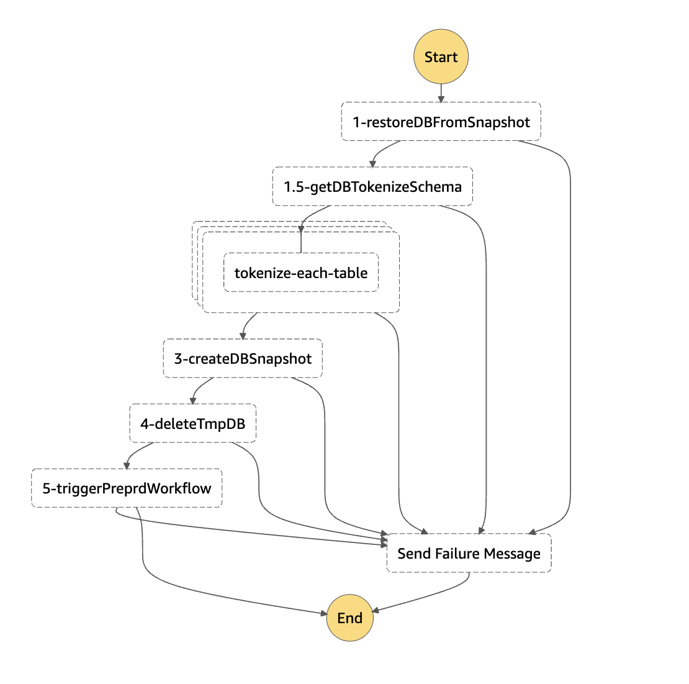

# Summary

I have personally encountered situations where the application team needs to periodically transfer similar data, excluding sensitive Personally Identifiable Information (PII), from the production database to a non-production environment for loading tests.

Personal Identifiable Information (PII) is any data that could potentially be used to identify a particular Person / Company / Entity.

To address this requirement, the proposed solution leverages various AWS services, including StepFunction, AWS Batch (on Fargate), Event Bridge, and AWS SDK (boto3), to create a serverless implementation. The solution includes tokenizing the production database data and securely importing it into the pre-production account.

The approach adopts the [Serverless Framewrok](https://www.serverless.com/framework/docs/getting-started) and incorporates an example utilizing [FPE](https://en.wikipedia.org/wiki/Format-preserving_encryption) (Format Preserving Encryption) algorithm to encrypt sensitive fields in the database tables.

The process consists of two StepFunction workflows:

1. On the production environment side, the **Tokenized DB Data Creator** workflow restores data from the production database snapshot to create a temporary database. It then applies tokenization to the specified target table fields (which can be defined by the user) and generates a new snapshot of the tokenized database.

2. On the pre-production environment side, the **Tokenized DB Data Importer** workflow restores a new database from the previously generated tokenized database snapshot. This new database replaces the original non-production database, ensuring that sensitive information is securely masked while preserving the data format for testing purposes.

Amazon EventBridge offers two essential capabilities:

1. **Scheduled Rules**: These rules enable the triggering of production (PRD) side workloads at specified intervals. With this capability, you can schedule the generation of a tokenized database snapshot from the production database on a regular basis.

2. **Customized Event Rules**: These rules allow the triggering of pre-production (PRE-PRD) side workloads in response to custom events. You can use this capability to automate the restoration process from a tokenized database snapshot to the pre-production environment whenever needed. This ensures that the pre-production environment stays up-to-date with the latest tokenized data for testing purposes.

This pattern is designed to address scenarios where there is a requirement to transfer production-like database data to a non-production environment securely.

# Prerequisites

* 2 active AWS accounts (production/pre-production) 
* 2 AWS Credentials (2 profiles demo-prd/demo-preprd), configured. see [Configuration](https://docs.aws.amazon.com/cli/latest/userguide/cli-configure-files.html)
* Serverless Framework, installed and configured, see [Installation](https://www.serverless.com/framework/docs/getting-started)
* Serverless plugin (serverless-step-functions), installed, see [Installation](https://www.serverless.com/plugins/serverless-step-functions#install)
* Docker, installed and configured. For more information, see [Get Docker](https://docs.docker.com/get-docker/)
* Prerequisite infrastructure has been created (Production/Pre-Production RDS MySQL, Tokenization Schema, Tokenization encryption key). see [scripts](prerequisite/create.sh)
* The database schemas for both production and pre-production have been created, Production DB data has been successfully imported, see [scripts](prerequisite/test_db/create.sh)

In this example, we are utilizing the "[Employee Sample](https://dev.mysql.com/doc/employee/en/sakila-structure.html)" database as a demonstration production database. The schema of the database is structured as follows:
* 

In this example, we have defined the tokenization schema, which specifies the target tables and columns that need to be tokenized. The tokenization schema is structured as follows:

```
{
    "items": [
        {
            "table": "dept_emp",
            "tokenize_fields": {
                "int": ["emp_no"]
            }
        },
        {
            "table": "dept_manager",
            "tokenize_fields": {
                "int": ["emp_no"]
            }
        },
        {
            "table": "titles",
            "tokenize_fields": {
                "int": ["emp_no"]
            }
        },
        {
            "table": "employees",
            "tokenize_fields": {
                "int": ["emp_no"],
                "date": ["birth_date"],
                "string": ["first_name", "last_name"]
            }
        },
        {
            "table": "salaries",
            "tokenize_fields": {
                "int": ["emp_no"]
            }
        }
    ]
}
```

The FPE algorithm requires two essential parameters:
* Encryption Key: This key is used by the FPE algorithm to encrypt a string and produce encrypted text, or to decrypt encrypted text. The same key value must be used during decryption to correctly reverse the encryption process. For this example, the [ff3](https://pypi.org/project/ff3/) library mandates the **encryption key's length to be 16, 24, or 32 bytes**. In this implementation, we generate the encryption key using the passlib Python library, utilizing a salt and password.

```
import sys
password='Test'
salt=''
key = pbkdf2(password, salt, 1024, keylen=32, prf='hmac-sha512').hex()
print("Generated key:", key)
Generated key: 93473a8c268bc103bc8d9cbc1922faf7135e5e7d8ee749bda6611b60cc68db43
```

* Tweak: Tweak is an additional input parameter utilized in FPE algorithms to enhance the encryption process's security and flexibility. The same tweak value must be used during decryption to ensure the correct decryption of the data. For this example, the ff3 library requires the **tweak's length to be either 7 bytes or 8 bytes**. We generate the tweak value using the secrets Python library.

```
import secrets
# Generate a 128-bit (16-byte) random tweak value
tweak = secrets.token_bytes(8).hex()
print("Generated tweak:", tweak)
Generated tweak: 37a057eca09d2413
```

Below is a demo code using the ff3 Python library:

```
from ff3 import FF3Cipher
from passlib.utils.pbkdf2 import pbkdf2
import sys
import secrets

tweak = secrets.token_bytes(8).hex()
password='Test'
salt='mnemonicBILL'
key = pbkdf2(password, salt, 1024, keylen=32, prf='hmac-sha512').hex()

chars="ABCDEFGHIJKLMNOPQRSTUVWXYZ0123456789"
plaintext="ABC010123"

c = FF3Cipher.withCustomAlphabet(key, tweak, chars)

ciphertext = c.encrypt(plaintext)
decrypted = c.decrypt(ciphertext)


print(f"Password: {password}")
print(f"Char set: {chars}")
print(f"Encrypted: {ciphertext}")
print(f"Decrypted: {decrypted}")

#print out
Password: Test
Char set: ABCDEFGHIJKLMNOPQRSTUVWXYZ0123456789
Encrypted: V0S4EQMRW
Decrypted: ABC010123
```

We have securely stored the salt, password, and tweak parameters in AWS Secrets Manager as follows:

1. **Salt**: The randomly generated salt, used in the process of generating the encryption key, has been securely stored in AWS Secrets Manager. This salt ensures the uniqueness and complexity of the encryption key, enhancing the security of the encryption process.
2. **Password**: The password used during the generation of the encryption key has been securely stored in AWS Secrets Manager. By keeping the password in a centralized and protected location, we ensure the confidentiality and integrity of the encryption key generation process.
3. **Tweak**: The randomly generated tweak value, an additional input parameter in the FPE algorithm, has also been securely stored in AWS Secrets Manager. Storing the tweak securely helps maintain the security and consistency of the encryption and decryption process.

By utilizing AWS Secrets Manager, we ensure that these sensitive parameters are effectively managed and protected, reducing the risk of unauthorized access and ensuring the security of the FPE encryption process.

# Product versions

* Terraform v1.3.6
* RDS MySQL: 8.0.32
* Serverless Framework: 3.32.2
* Docker version 24.0.2
* Serverless Plugin (serverless-step-functions: 3.13.1)

# Architecture


The diagram above illustrates the following sequential flows:

1. Users initiate the process by building and pushing a container image, containing all the batch job scripts, to the Amazon Elastic Container Registry (ECR).
2. Users upload the tokenization schema to the Parameter Store, defining the target tables and columns that need to undergo tokenization.
3. Users also upload the tokenize key, which is utilized by the FPE Python library in the tokenization script.
4. The Production (PRD) StateMachine can be triggered either automatically by a Scheduled Rule (e.g., 12:00 UTC on the first day of every month using the `cron("0 12 1 * ? *)`, or it can be triggered manually by a user.
5. Additionally, the PRD State Machine provides the capability to be manually triggered by users, offering flexibility in initiating the tokenization process.
6. Upon activation, the PRD StateMachine executes the tokenization process, generating a tokenized database snapshot. This snapshot is then shared securely with the Pre-Production (PREPRD) account.
7. The Pre-Production (PREPRD) StateMachine is triggered by a Customized Event, generated by the PRD StateMachine after the successful tokenization process.
8. Once activated, the PREPRD StateMachine proceeds to create a new database from the tokenized snapshot, effectively replacing the old non-production database. This ensures that sensitive data is masked while preserving data format in the pre-production environment.

## prd stepfunction workflow



The diagram above outlines the PROD (Production) workflow, consisting of the following steps:
* 1 - The workflow begins by restoring the latest snapshot of the PRD (Production) database, creating a temporary DB for further processing.
* 1.5 - The tokenize schema, containing information about the target tables and columns to be tokenized, is retrieved from the Parameter Store.
* 2 - The tokenize job is executed in parallel on the multiple tables of the temporary DB, efficiently tokenizing the specified data.
* 3 - Once the tokenization process is completed, a new snapshot of the tokenized database is generated and securely shared with the PREPRD (Pre-Production) account for further usage.
* 4 - After the successful completion of the entire process, the temporary DB is deleted, ensuring no residual data remains.
* 5 - To trigger the PREPRD workflow, a customized event is placed onto the EventBus, initiating the subsequent actions in the pre-production environment.
* An error handling mechanism is in place to address any issues that may arise during each step. In the event of an error, a failure message will be sent through the SNS (Simple Notification Service), notifying relevant stakeholders for prompt resolution and follow-up actions.

## preprd stepfunction workflow


The diagram above illustrates the following PREPROD (Pre-Production) workflow steps:
* 6 - The workflow commences by copying the tokenized database snapshot from the PRD (Production) account to the PREPROD environment.
* 7 - After successfully copying the tokenized snapshot, the workflow proceeds to restore the snapshot, creating a new and up-to-date database in the PREPROD environment.
* 8 - Finally, the old database in the PREPROD environment is replaced with the newly created database from the tokenized snapshot. This ensures that sensitive data is securely masked, allowing for a safe and confidential testing and development environment without compromising data integrity.
* An error handling mechanism is in place to address any issues that may arise during each step. In the event of an error, a failure message will be sent through the SNS (Simple Notification Service), notifying relevant stakeholders for prompt resolution and follow-up actions.

# Automation

This pattern is highly suitable for scenarios where the application team needs to perform periodic data transfers from the production database to a non-production environment, such as a monthly data refresh. By adopting this pattern, the entire workflow can be fully automated, ensuring efficient execution of the data transfer process.

The automation encompasses tasks like generating the tokenized database snapshot in the production environment, securely sharing it with the pre-production environment, and subsequently restoring the tokenized data into the pre-production database. The automation streamlines the entire process, reducing manual intervention and human error risks while ensuring data privacy and security in both environments.

With this pattern, the application team can confidently and reliably perform scheduled data transfers, allowing them to focus on other critical tasks, as the entire workflow operates autonomously. The automation aspect significantly enhances the efficiency, consistency, and reliability of the data transfer process for regular testing, development, or analytics purposes in the non-production environment.

# Scaling

The StepFunction [Map](https://docs.aws.amazon.com/step-functions/latest/dg/amazon-states-language-map-state.html) state is a powerful feature that allows us to execute multiple workflows concurrently. It takes an input array and returns an output array, where the size of the both arrays is the number of the concurrent workflows that will be executed. To control the overall concurrent states, we define the entity MaxConcurrency while creating the Map state.

In the Tokenize job, we utilize the [Map inline mode](https://docs.aws.amazon.com/step-functions/latest/dg/concepts-asl-use-map-state-inline.html), taking the tokenize schema as an input array and executing the tokenize job on multiple tables in parallel. This allows us to efficiently process large amounts of data concurrently.

For this demo, we have set `MaxConcurrency=10`, which can be adjusted based on your specific workload patterns. In Map inline mode, the StepFunction can support up to 40 concurrent iterations, which means we can efficiently handle a significant number of parallel tasks.

By leveraging the Map state with appropriate MaxConcurrency settings, we can optimize the performance and throughput of the tokenization process, ensuring efficient data processing in both the production and pre-production environments.

# Limitation

* **Tokenization Schema Management**: The tokenization schema is stored in a parameter store, which could potentially lead to untokenized data if any declarations are missing or incorrect. Careful attention is required to ensure all relevant tables and columns are properly defined in the schema.

* **Tokenize Job Concurrency at Table Level**: The tokenization job can only be executed at the table level and not at the record level. Consequently, the time taken for the tokenization process is determined by the largest table in the dataset, which may lead to inefficiencies for tables with significantly different sizes.

* **FPE Dependency**: The tokenization script demonstrated in the current demo is tailored to utilize the FPE algorithm. If you intend to employ a different encryption algorithm for the tokenization process, adjustments and modifications to the tokenization script will be required to accommodate the specific algorithm's implementation and ensure seamless integration into the workflow.

* **DB Engine Dependency**: The current demo's tokenization script is designed specifically for the MySQL DB engine. If you intend to use a different database engine, modifications to the tokenization script will be necessary to accommodate the specific requirements of the chosen engine.

* **Downtime during PREPRD DB Replacement**: In the process of replacing the PREPRD database with the new tokenized database, the old database must first be deleted and the new one renamed, leading to downtime for the PREPRD environment. This downtime should be taken into account when planning data refresh schedules.

* **Concurrent Iterations Limitation**: The Map inline mode employed in the tokenize job can handle up to 40 concurrent iterations. If you require running the tokenize job on more than 40 tables in parallel, you will need to use the Map distributed mode. to accommodate the additional concurrency.

Addressing these limitations and considering the specific needs of your data transfer and tokenization requirements will result in a more robust and efficient implementation.

# Prepare Runbook

1. install serverless CLI and plugin

```
npm install
```

2. run script to create DB, tokenization schema, tokenization encrypt key.

```
cd prerequisite
terraform init
terraform plan
terraform apply
```

3. set PRD DB endpoint/credentials in prerequisite/test_db/create.sh file

```
PRD_DB_ENDPOINT=<YOUR_PRD_DB_ENDPOINT>
DB_USER=<YOUR_DB_USER>
DB_PASS=<YOUR_DB_PASS>
```

4. modify SecurityGroup allow MyIP to access PRD DB endpoint

5. run script to create DB schema and load DB data

```
cd prerequisite/test_db
bash create.sh
```

6. check created resources and DB data

```
mysql> show tables;
+----------------------+
| Tables_in_employees  |
+----------------------+
| current_dept_emp     |
| departments          |
| dept_emp             |
| dept_emp_latest_date |
| dept_manager         |
| employees            |
| salaries             |
| titles               |
+----------------------+
8 rows in set (0.01 sec)

mysql> select count(1) from salaries;
+----------+
| count(1) |
+----------+
|  2844047 |
+----------+
1 row in set (0.80 sec)

mysql> select count(1) from employees;
+----------+
| count(1) |
+----------+
|   300024 |
+----------+
1 row in set (0.65 sec)
```


7. In the project root folder, deploy prod / pre-prod account stepFunction StateMachine

```
sls deploy --stage prd
sls deploy --stage preprd
```

8. In the project scripts folder, build docker image, push to ECR repository

```
cd scripts
bash build_image.sh prd
bash build_image.sh preprd
```

# Test
1. trigger PRD stateMachime from AWS CLI or console

```
aws --profile demo-prd stepfunctions start-execution --state-machine-arn <PRD_STATE_MACHINE_ARN>

#go to PRD StepFunction console, wait all batch jobs finished
aws --profile demo-prd stepfunctions list-executions --state-machine-arn <PRD_STATE_MACHINE_ARN>

{
    "executions": [
        {
            "executionArn": "..",
            "stateMachineArn": "..",
            "name": "..",
            "status": "SUCCEEDED",
            "startDate": "..",
            "stopDate": ".."
        },
    ]
}

#go to PREPRD StepFunction console, PREPRD stateMachine will be triggered automatically, wait all batch jobs finished.
aws --profile demo-preprd stepfunctions list-executions --state-machine-arn <PREPRD_STATE_MACHINE_ARN>
{
    "executions": [
        {
            "executionArn": "..",
            "stateMachineArn": "..",
            "name": "..",
            "status": "SUCCEEDED",
            "startDate": "..",
            "stopDate": ".."
        },
    ]
}
```

2. go to PREPRD RDS console, PREPRD DB is created. get the DB endpoint. access PRD DB and PREPRD DB to confirm data with emp_no = 10001 (according to fpe algorithm, after fpe encryption, 10001 will become 8869913)

```
# PRD DB
mysql> select t1.emp_no,t2.birth_date,t2.first_name,t2.last_name,t3.title from salaries t1 INNER JOIN employees t2 INNER JOIN titles t3 where t1.emp_no=t2.emp_no and t2.emp_no=t3.emp_no and t1.emp_no=10001;
 +--------+------------+------------+-----------+-----------------+
 | emp_no | birth_date | first_name | last_name | title           |
 +--------+------------+------------+-----------+-----------------+
 |  10001 | 1953-09-02 | Georgi     | Facello   | Senior Engineer |
 |  10001 | 1953-09-02 | Georgi     | Facello   | Senior Engineer |
 |  10001 | 1953-09-02 | Georgi     | Facello   | Senior Engineer |
 |  10001 | 1953-09-02 | Georgi     | Facello   | Senior Engineer |
 |  10001 | 1953-09-02 | Georgi     | Facello   | Senior Engineer |
 |  10001 | 1953-09-02 | Georgi     | Facello   | Senior Engineer |
 |  10001 | 1953-09-02 | Georgi     | Facello   | Senior Engineer |
 |  10001 | 1953-09-02 | Georgi     | Facello   | Senior Engineer |
 |  10001 | 1953-09-02 | Georgi     | Facello   | Senior Engineer |
 |  10001 | 1953-09-02 | Georgi     | Facello   | Senior Engineer |
 |  10001 | 1953-09-02 | Georgi     | Facello   | Senior Engineer |
 |  10001 | 1953-09-02 | Georgi     | Facello   | Senior Engineer |
 |  10001 | 1953-09-02 | Georgi     | Facello   | Senior Engineer |
 |  10001 | 1953-09-02 | Georgi     | Facello   | Senior Engineer |
 |  10001 | 1953-09-02 | Georgi     | Facello   | Senior Engineer |
 |  10001 | 1953-09-02 | Georgi     | Facello   | Senior Engineer |
 |  10001 | 1953-09-02 | Georgi     | Facello   | Senior Engineer |
 +--------+------------+------------+-----------+-----------------+
17 rows in set (0.01 sec)

# PREPRD DB
mysql> select t1.emp_no,t1.salary,t2.birth_date,t2.first_name,t2.last_name,t3.title from salaries t1 INNER JOIN employees t2 INNER JOIN titles t3 where t1.emp_no=t2.emp_no and t2.emp_no=t3.emp_no and t1.emp_no=8869913;
 +---------+------------+------------+-----------+-----------------+
 | emp_no  | birth_date | first_name | last_name | title           |
 +---------+------------+------------+-----------+-----------------+
 | 8869913 | 1953-09-01 | mGUrMyr    | DRYbJDJ   | Senior Engineer |
 | 8869913 | 1953-09-01 | mGUrMyr    | DRYbJDJ   | Senior Engineer |
 | 8869913 | 1953-09-01 | mGUrMyr    | DRYbJDJ   | Senior Engineer |
 | 8869913 | 1953-09-01 | mGUrMyr    | DRYbJDJ   | Senior Engineer |
 | 8869913 | 1953-09-01 | mGUrMyr    | DRYbJDJ   | Senior Engineer |
 | 8869913 | 1953-09-01 | mGUrMyr    | DRYbJDJ   | Senior Engineer |
 | 8869913 | 1953-09-01 | mGUrMyr    | DRYbJDJ   | Senior Engineer |
 | 8869913 | 1953-09-01 | mGUrMyr    | DRYbJDJ   | Senior Engineer |
 | 8869913 | 1953-09-01 | mGUrMyr    | DRYbJDJ   | Senior Engineer |
 | 8869913 | 1953-09-01 | mGUrMyr    | DRYbJDJ   | Senior Engineer |
 | 8869913 | 1953-09-01 | mGUrMyr    | DRYbJDJ   | Senior Engineer |
 | 8869913 | 1953-09-01 | mGUrMyr    | DRYbJDJ   | Senior Engineer |
 | 8869913 | 1953-09-01 | mGUrMyr    | DRYbJDJ   | Senior Engineer |
 | 8869913 | 1953-09-01 | mGUrMyr    | DRYbJDJ   | Senior Engineer |
 | 8869913 | 1953-09-01 | mGUrMyr    | DRYbJDJ   | Senior Engineer |
 | 8869913 | 1953-09-01 | mGUrMyr    | DRYbJDJ   | Senior Engineer |
 | 8869913 | 1953-09-01 | mGUrMyr    | DRYbJDJ   | Senior Engineer |
 +---------+------------+------------+-----------+-----------------+
17 rows in set (0.89 sec)
```

# Compare to AWS DMS solution
The DMS solution can achieve database masking by utilizing Change Data Capture (CDC) combined with a transformation script. here

* Limitations of the DMS solution:

    1. The DMS solution requires long-term running EC2 instances and involves streaming changes during replication, leading to higher operational costs compared to the serverless approach in this pattern.
    2. DMS transformation rules are limited to supporting DB built-in algorithms for masking data, making it unable to accommodate the FPE (Format-Preserving Encryption) algorithm utilized in this pattern.

* Pros of this pattern:

    1. Flexibility in triggering the tokenization process based on business requirements, such as scheduling (e.g., once every 3 months), manual triggering, or a combination of both.
    2. Support for the FPE algorithm, enabling secure data masking while preserving data format.
    3. Lower overall costs when compared to the DMS solution due to the serverless nature of this pattern.

* Cons of this pattern:

    1. The tokenization script provided in this demo is specifically designed for MySQL and the FPE algorithm. If other database engines or tokenization algorithms are needed, additional development and testing will be necessary.
    2. This pattern is not suitable for scenarios where real-time replication of the non-production database from the production database is required.

In summary, this pattern offers advantages over the DMS solution in terms of cost efficiency, flexibility in triggering, and support for the FPE algorithm. However, it may require customization for other database engines and tokenization algorithms, which should be considered based on the specific use case requirements.

# Best Practices Reminder

This project aims to provide a solid foundation for developing a workflow for tokenizing data from the production database and securely loading it into the pre-production environment. However, please be aware that certain best practices are not explicitly demonstrated in the demo. 

**Enhanced Security**

Tokenization *KEY* and *PASSWORD* saved in SecretManager. If you choose to incorporate this demo into your project, it's your responsibility to establish a secure rotation mechanism for enhanced security. 

**Enhanced Monitoring**

You can use AWS X-Ray to visualize the components of your state machine, identify performance bottlenecks, and troubleshoot requests that resulted in an error.

* [xray-for-sns](https://docs.aws.amazon.com/xray/latest/devguide/xray-services-sns.html)
* [xray-for-stepFunction](https://docs.aws.amazon.com/step-functions/latest/dg/concepts-xray-tracing.html)
* [xray-for-batchJob](https://aws.amazon.com/blogs/mt/configure-aws-x-ray-tracing-aws-batch-jobs/)

## Security

See [CONTRIBUTING](CONTRIBUTING.md#security-issue-notifications) for more information.

## License

This library is licensed under the MIT-0 License. See the LICENSE file.

